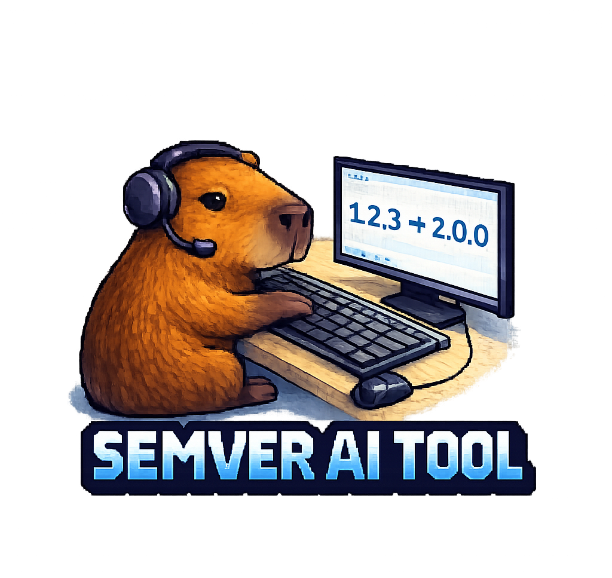

<p align="center">
  
</p>

# SemVer AI Tool (Español)

[English](./README.md) | **Español**

**SemVer AI Tool** es una herramienta de interfaz de línea de comandos (CLI) de próxima generación que automatiza el versionado semántico y la generación de notas de lanzamiento profesionales utilizando Inteligencia Artificial y Conventional Commits.

---

## 🚀 Características
- **Versionado Semántico Automático**: Detecta `feat:`, `fix:`, y `BREAKING CHANGE:` en tu último commit para actualizar la versión de forma segura.
- **Notas de Lanzamiento con IA**: Analiza las diferencias de código (diffs) a través de la API de Groq (Llama 3.3) y genera informes técnicos profesionales.
- **Seguridad Integrada**: Maneja credenciales localmente con auto-protección de `.gitignore` para evitar filtraciones de API Keys.
- **Multilingüe**: Soporta la generación de documentación tanto en Inglés como en Español.

## 📦 Instalación y Uso (Vía NPX)

Esta herramienta está diseñada al estilo moderno de Shadcn: **cero instalaciones globales**. Puedes ejecutarla en cualquier momento desde tu terminal.

### 1. Inicializar el proyecto
Ejecuta el asistente interactivo en tu proyecto (te pedirá tu API Key de Groq y nombre de autor):

```bash
npx github:gonzalogomezprojects/semver-ai-tool init
```

### 2. Generar un Release
Una vez que hayas hecho tus commits siguiendo la convención, lanza la magia:

```bash
npx github:gonzalogomezprojects/semver-ai-tool release
```

## 📚 Documentación Técnica
Para una comprensión profunda de la lógica interna, consulta nuestra [Arquitectura Técnica](./src/docs/es/technical-architecture.md).

## 👨‍💻 Autor
Desarrollado con ❤️ por **Gonzalo S. A. Gómez** en [Sarit Startup](https://saritstartup.com.ar/).  
Conéctate conmigo en [LinkedIn](https://www.linkedin.com/in/gonzalogomezprojects/).

## 📄 Licencia
MIT License
