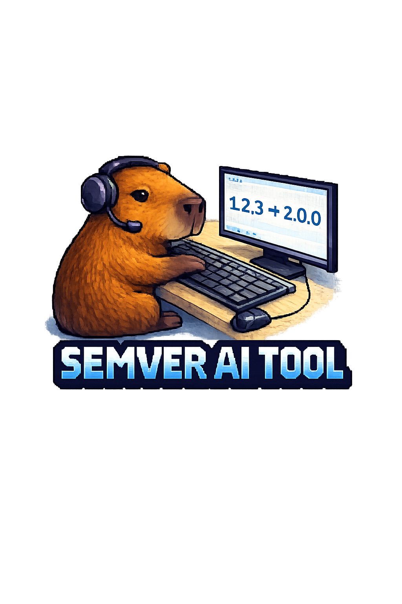

<p align="center">
  
</p>

# SemVer AI Tool

**SemVer AI Tool** is a next-generation command-line interface (CLI) tool that automates semantic versioning and professional release notes generation using Artificial Intelligence and Conventional Commits.

Built with software engineering best practices, this tool ensures global setup without tampering with system-level paths (like Windows `System32`), operates securely with local user credentials, and maintains highly modular architecture.

## Features
- **Semantic Versioning Automation**: Detects \`feat:\`, \`fix:\`, and \`BREAKING CHANGE:\` from your last commit to safely bump SemVer.
- **AI-Powered Release Notes**: Understands code diffs via Groq API (e.g. LLaMA 3.1) and generates professional markdown release notes.
- **Adapter Pattern**: Supports Node.js (\`package.json\`), Python, Maven, or a generic \`VERSION\` file.
- **Secure by Default**: Stores API credentials globally at \`~/.semver-ai/credentials.env\` instead of project-level files, preventing leaks.

## Installation

Run the installation script. This will download dependencies (\`jq\`), configure the binaries in your home directory, and prepare the CLI.

```bash
./install.sh
```

**Post-Installation:**
1. Add \`~/.semver-ai/bin\` to your system's \`PATH\` variable.
2. Edit \`~/.semver-ai/credentials.env\` and add your Groq API key and your Author Name.

## Usage

Navigate to any project repository:

1. **Initialize the tool in the project**:
   ```bash
   semver-ai init
   ```
   *Follow the wizard to select your technology stack.*

2. **Commit your code using Conventional Commits**:
   ```bash
   git add .
   git commit -m "feat: Add user authentication system"
   ```

3. **Generate the Release**:
   ```bash
   semver-ai release
   ```
   *This bumps the version in your project file and generates a markdown documentation file inside the configured documentation directory.*

## Contributing
Pull requests are welcome. For major changes, please open an issue first to discuss what you would like to change.

## License
MIT License
