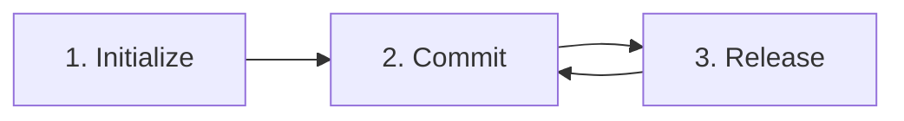

# Usage Guide & Workflow

This guide explains how to integrate **SemVer AI Tool** into your development workflow to automate versioning and release notes generation using AI and Conventional Commits.

---

## 📐 The Standard Workflow

The tool follows a simple 3-step lifecycle:



### 1. Project Initialization
The first time you use the tool in a project, you must initialize it. This creates a local configuration file and sets up security.

```bash
npx github:gonzalogomezprojects/semver-ai-tool init
```
*   **What happens?**: You will be asked for your project name, author name, preferred language (en/es), and your **Groq API Key**.
*   **Result**: A `.semver-ai.json` file is created. The tool automatically adds this file to your `.gitignore` to prevent API key leaks.

### 2. Development & Conventional Commits
As you develop, you must use the **Conventional Commits** standard for your commit messages. **SemVer AI Tool** analyzes **all commits** since your last release tag to determine the optimal version bump.

| Commit Prefix | SemVer Bump | Description |
| :--- | :--- | :--- |
| `fix:` | **Patch** (0.0.x) | Bug fixes. |
| `feat:` | **Minor** (0.x.0) | New features. |
| `feat!:` / `fix!:` | **Major** (x.0.0) | Breaking changes (using the `!` indicator). |
| `BREAKING CHANGE:` | **Major** (x.0.0) | Breaking changes found in the commit footer. |

**Example:**
```bash
git commit -m "feat(auth): add social login support"
```

### 3. Creating a Release
Once you are ready to release your changes, run the release command:

```bash
npx github:gonzalogomezprojects/semver-ai-tool release
```

*   **Logic**:
    1.  **Analysis**: Scans the git history from the **latest tag** to the current state.
    2.  **Versioning**: Calculates the highest priority bump (`major` > `minor` > `patch`) detected in the history.
    3.  **Bumping**: Updates the `version` field in your `package.json`.
    4.  **AI Power**: Sends the cumulative commit history and total code diff to the AI for synthesis.
    5.  **Documentation**: Generates a professional Markdown file in `docs/releases/`.
    6.  **Persistence**: Automatically creates a **git commit** and a **git tag** for the new version.

---

## 🛠️ Advanced Usage

### Manual Version Overrides
If you want to force a specific bump regardless of the commit history, you can pass an argument:

```bash
# Force a Major version bump
npx github:gonzalogomezprojects/semver-ai-tool release major
```

### Persistence and Safety
When a release is successful, the tool:
1.  Stages `package.json`, `package-lock.json` (if it exists), and the new release notes.
2.  Commits with the message `chore(release): vX.Y.Z [skip ci]`.
3.  Tags the commit as `vX.Y.Z`.

> [!TIP]
> After the command finishes, remember to run `git push --follow-tags` to push your new version to the remote server.

---

## 💡 Best Practices

1.  **Atomic Commits**: Even though the tool analyzes multiple commits, keeping them focused helps the AI generate more detailed and structured notes.
2.  **Conventional Consistency**: Always use standard prefixes. If you mix `feat` and `fix` in a release cycle, the tool will correctly choose `minor` to ensure no functionality is hidden in a patch.
3.  **Review Before Pushing**: Always check the generated file in `docs/releases/` and the version change before pushing to production.

