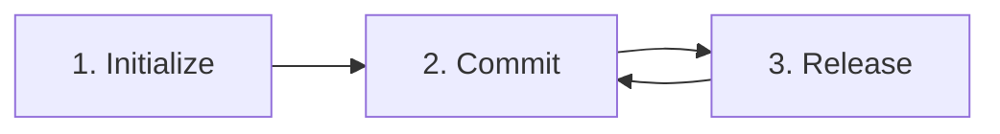

# Usage Guide & Workflow

This guide explains how to integrate **SemVer AI Tool** into your development workflow to automate versioning and release notes generation using AI and Conventional Commits.

---

## 📐 The Standard Workflow

The tool follows a simple 3-step lifecycle:



### 1. Project Initialization
The first time you use the tool in a project, you must initialize it. This creates a local configuration file and sets up security.

```bash
npx github:gonzalogomezprojects/semver-ai-tool init
```
*   **What happens?**: You will be asked for your project name, author name, preferred language (en/es), and your **Groq API Key**.
*   **Result**: A `.semver-ai.json` file is created. The tool automatically adds this file to your `.gitignore` to prevent API key leaks.

### 2. Development & Conventional Commits
As you develop, you must use the **Conventional Commits** standard for your commit messages. The tool uses the *last commit* to determine the version bump.

| Commit Prefix | SemVer Bump | Description |
| :--- | :--- | :--- |
| `fix:` | **Patch** (0.0.x) | Bug fixes. |
| `feat:` | **Minor** (0.x.0) | New features. |
| `BREAKING CHANGE:` | **Major** (x.0.0) | Breaking changes (found in footer or as `feat!:`). |

**Example:**
```bash
git commit -m "feat(auth): add social login support"
```

### 3. Creating a Release
Once you are ready to release your changes, run the release command:

```bash
npx github:gonzalogomezprojects/semver-ai-tool release
```

*   **Logic**:
    1.  **Analysis**: Reads the last commit message.
    2.  **Versioning**: Calculates if it's a `patch`, `minor`, or `major` bump.
    3.  **Bumping**: Updates the `version` field in your `package.json`.
    4.  **AI Power**: Sends the commit message and the actual code diff to the AI.
    5.  **Documentation**: Generates a professional Markdown file in `docs/releases/`.

---

## 🛠️ Advanced Usage

### Manual Version Overrides
If you want to force a specific bump regardless of the commit message, you can pass an argument:

```bash
# Force a Major version bump
npx github:gonzalogomezprojects/semver-ai-tool release major

# Force a Minor version bump
npx github:gonzalogomezprojects/semver-ai-tool release minor

# Force a Patch version bump
npx github:gonzalogomezprojects/semver-ai-tool release patch
```

### Security & Credentials
The tool stores your Groq API Key in `.semver-ai.json` inside your project root. 
> [!IMPORTANT]
> Always ensure `.semver-ai.json` is in your `.gitignore`. The `init` command does this automatically for you.

---

## 💡 Best Practices

1.  **Atomized Commits**: Try to include a single feature or fix per commit if you want the release notes to be specific.
2.  **Descriptive Commits**: The AI reads your commit message and the code diff. The better your code is structured and your message is written, the better the release notes will be.
3.  **Review Releases**: Always check the generated file in `docs/releases/` before pushing your new version to production.
