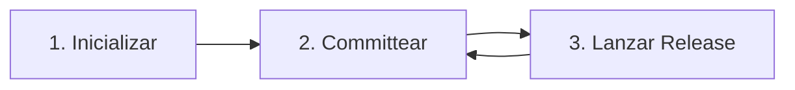

# Guía de Uso y Flujo de Trabajo

Esta guía explica cómo integrar **SemVer AI Tool** en tu flujo de desarrollo para automatizar el versionado y la generación de notas de lanzamiento utilizando IA y Conventional Commits.

---

## 📐 El Flujo de Trabajo Estándar

La herramienta sigue un ciclo de vida simple de 3 pasos:



### 1. Inicialización del Proyecto
La primera vez que uses la herramienta en un proyecto, debes inicializarla. Esto crea un archivo de configuración local y configura la seguridad.

```bash
npx github:gonzalogomezprojects/semver-ai-tool init
```
*   **¿Qué sucede?**: Se te preguntará el nombre del proyecto, nombre del autor, el idioma preferido (en/es) y tu **API Key de Groq**.
*   **Resultado**: Se crea un archivo `.semver-ai.json`. La herramienta lo agrega automáticamente a tu `.gitignore` para evitar fugas de tu clave API.

### 2. Desarrollo y Conventional Commits
Mientras desarrollas, debes usar el estándar de **Conventional Commits** para tus mensajes de commit. La herramienta utiliza el *último commit* para determinar el salto de versión.

| Prefijo de Commit | Salto SemVer | Descripción |
| :--- | :--- | :--- |
| `fix:` | **Patch** (0.0.x) | Corrección de errores. |
| `feat:` | **Minor** (0.x.0) | Nuevas funcionalidades. |
| `BREAKING CHANGE:` | **Major** (x.0.0) | Cambios que rompen la compatibilidad. |

**Ejemplo:**
```bash
git commit -m "feat(auth): add social login support"
```

### 3. Crear una Release
Cuando estés listo para lanzar tus cambios, ejecuta el comando de release:

```bash
npx github:gonzalogomezprojects/semver-ai-tool release
```

*   **Lógica**:
    1.  **Análisis**: Lee el último mensaje de commit.
    2.  **Versionado**: Calcula si es un salto `patch`, `minor` o `major`.
    3.  **Actualización**: Actualiza el campo `version` en tu `package.json`.
    4.  **Poder de IA**: Envía el mensaje de commit y el diff del código real a la IA.
    5.  **Documentación**: Genera un archivo Markdown profesional en `docs/releases/`.

---

## 🛠️ Uso Avanzado

### Sobrescritura Manual de Versión
Si deseas forzar un salto específico independientemente del mensaje de commit, puedes pasar un argumento:

```bash
# Forzar un salto de versión Major
npx github:gonzalogomezprojects/semver-ai-tool release major

# Forzar un salto de versión Minor
npx github:gonzalogomezprojects/semver-ai-tool release minor

# Forzar un salto de versión Patch
npx github:gonzalogomezprojects/semver-ai-tool release patch
```

### Seguridad y Credenciales
La herramienta almacena tu API Key de Groq en `.semver-ai.json` dentro de la raíz de tu proyecto.
> [!IMPORTANT]
> Asegúrate siempre de que `.semver-ai.json` esté en tu `.gitignore`. El comando `init` lo hace automáticamente por ti.

---

## 💡 Mejores Prácticas

1.  **Commits Atómicos**: Intenta incluir una sola funcionalidad o corrección por commit si quieres que las notas de lanzamiento sean específicas.
2.  **Commits Descriptivos**: La IA lee tu mensaje de commit y el diff del código. Cuanto mejor esté estructurado tu código y escrito tu mensaje, mejores serán las notas de lanzamiento.
3.  **Revisar Releases**: Siempre revisa el archivo generado en `docs/releases/` antes de subir tu nueva versión a producción.
