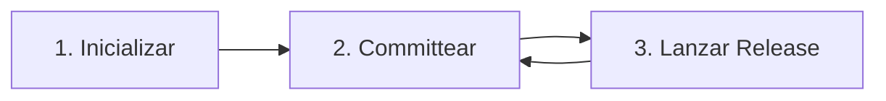

# Guía de Uso y Flujo de Trabajo

Esta guía explica cómo integrar **SemVer AI Tool** en tu flujo de desarrollo para automatizar el versionado y la generación de notas de lanzamiento utilizando IA y Conventional Commits.

---

## 📐 El Flujo de Trabajo Estándar

La herramienta sigue un ciclo de vida simple de 3 pasos:



### 1. Inicialización del Proyecto
La primera vez que uses la herramienta en un proyecto, debes inicializarla. Esto crea un archivo de configuración local y configura la seguridad.

```bash
npx github:gonzalogomezprojects/semver-ai-tool init
```
*   **¿Qué sucede?**: Se te preguntará el nombre del proyecto, nombre del autor, el idioma preferido (en/es) y tu **API Key de Groq**.
*   **Resultado**: Se crea un archivo `.semver-ai.json`. La herramienta lo agrega automáticamente a tu `.gitignore` para evitar fugas de tu clave API.

### 2. Desarrollo y Conventional Commits
Mientras desarrollas, debes usar el estándar de **Conventional Commits** para tus mensajes de commit. **SemVer AI Tool** analiza **todos los commits** desde tu último lanzamiento (tag) para determinar el salto de versión óptimo.

| Prefijo de Commit | Salto SemVer | Descripción |
| :--- | :--- | :--- |
| `fix:` | **Patch** (0.0.x) | Corrección de errores. |
| `feat:` | **Minor** (0.x.0) | Nuevas funcionalidades. |
| `feat!:` / `fix!:` | **Major** (x.0.0) | Cambios que rompen compatibilidad (con indicador `!`). |
| `BREAKING CHANGE:` | **Major** (x.0.0) | Cambios que rompen la compatibilidad en el cuerpo del commit. |

**Ejemplo:**
```bash
git commit -m "feat(auth): add social login support"
```

### 3. Crear una Release
Cuando estés listo para lanzar tus cambios, ejecuta el comando de release:

```bash
npx github:gonzalogomezprojects/semver-ai-tool release
```

*   **Lógica**:
    1.  **Análisis**: Escanea el historial de Git desde el **último tag** hasta el estado actual.
    2.  **Versionado**: Calcula el salto de mayor prioridad (`major` > `minor` > `patch`) detectado en el rango.
    3.  **Actualización**: Actualiza el campo `version` en tu `package.json`.
    4.  **Poder de IA**: Envía el historial acumulado y el diff total a la IA para una síntesis profesional.
    5.  **Documentación**: Genera un archivo Markdown en `docs/releases/`.
    6.  **Persistencia**: Crea automáticamente un **commit de git** y un **tag de versión**.

---

## 🛠️ Uso Avanzado

### Sobrescritura Manual de Versión
Si deseas forzar un salto específico independientemente del historial, puedes pasar un argumento:

```bash
# Forzar un salto de versión Major
npx github:gonzalogomezprojects/semver-ai-tool release major
```

### Persistencia y Seguridad
Al finalizar una release con éxito, la herramienta:
1.  Prepara (`stage`) el `package.json`, `package-lock.json` (si existe) y la nueva nota de release.
2.  Realiza un commit con el mensaje `chore(release): vX.Y.Z [skip ci]`.
3.  Etiqueta (tag) el commit como `vX.Y.Z`.

> [!TIP]
> Tras el comando, recuerda ejecutar `git push --follow-tags` para subir la nueva versión a tu repositorio remoto.

---

## 💡 Mejores Prácticas

1.  **Commits Atómicos**: Aunque la herramienta analiza múltiples commits, mantenerlos enfocados ayuda a la IA a generar notas más estructuradas.
2.  **Consistencia Convencional**: Usa siempre prefijos estándar. Si mezclas `feat` y `fix`, la herramienta elegirá `minor` para asegurar la visibilidad de la nueva funcionalidad.
3.  **Revisión Final**: Siempre revisa el archivo generado en `docs/releases/` y el cambio de versión antes de desplegar a producción.

